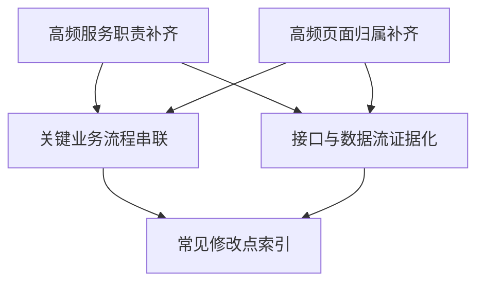

# 服务与前端上下文补齐需求拆解

## 背景

目标时间点：7/25

工作目标：优先覆盖高频服务、高频页面和关键业务流程，补齐服务职责、接口关系、页面归属、数据流向和常见修改点，降低 AI 误判代码归属和返工成本。

在 Yog 的产品语义中，本目标不应按代码目录或服务模块直接沉淀为知识边界，而应围绕业务上下文、业务能力、业务流程和实现证据组织：

- `CONTEXT-MAP.md` 负责业务上下文路由。
- `contexts/<context-id>/CONTEXT.md` 负责业务语言和边界。
- `capabilities/` 负责业务能力职责、非职责和流程说明。
- `evidence/` 负责页面、接口、服务、数据、测试等代码事实。
- `business-flows/` 负责跨页面、服务和数据对象的端到端流程。

## 范围

### 覆盖范围

- 高频服务的职责、非职责、核心入口和上下游依赖。
- 高频前端页面的业务归属、页面入口、路由、接口调用和状态流向。
- 关键业务流程的端到端链路，包括页面、接口、服务、数据落点和测试锚点。
- 常见修改点的知识索引，帮助 AI 快速判断应该改哪里、不要改哪里。

### 非目标

- 不把服务名、目录名或页面文件名直接等同于业务上下文。
- 不从代码自动确认业务边界。
- 不把只有空目录或模板内容的 context 视为完成。
- 不修改目标仓库业务代码。
- 不引入 RAG、embedding 或运行时服务。

## 需求清单

| 需求ID | 需求名称 | 需求描述 | 用户故事 | 验收标准 | 优先级 | 依赖需求 | 预估工作量 | 涉及 Yog 模块 | 技术风险 |
|---|---|---|---|---|---|---|---|---|---|
| R001 | 高频服务职责补齐 | 为高频服务沉淀服务职责、非职责、核心入口、上下游依赖和常见修改点，避免 AI 只按目录名猜归属。 | 作为使用 Yog 的 agent，我希望能先理解高频服务在业务上下文中的职责，以便修改代码前判断正确归属。 | 1. 每个高频服务至少关联一个 `capability` 或 `evidence`。 2. 写清服务职责和非职责。 3. 关联入口文件、核心类/方法、接口、消息或任务。 4. 标注常见修改点和不应修改的位置。 | P0 | 无 | 3 人日 | `contexts/*/capabilities`、`evidence/*-call-flow.md`、`evidence/*-ops.md` | 中：服务边界可能与业务边界不一致，需要人工确认 |
| R002 | 高频页面归属补齐 | 为高频前端页面补齐页面归属、业务上下文、入口组件、路由、接口调用和状态流向。 | 作为使用 Yog 的 agent，我希望能知道页面属于哪个业务上下文，以便前端改动能定位到正确页面和接口链路。 | 1. 高频页面能映射到明确业务 context。 2. 页面入口、路由、主要组件和接口调用有 evidence。 3. 写清页面负责什么、不负责什么。 4. 常见 UI 修改点可被快速定位。 | P0 | 无 | 3 人日 | `evidence/*-ui.md`、`capabilities/`、`CONTEXT-MAP.md` | 中：页面可能跨多个业务上下文，需要记录关系而不是强行归一 |
| R003 | 关键业务流程串联 | 用 `business-flows` 记录跨页面、服务、接口和数据对象的端到端业务流程。 | 作为使用 Yog 的 agent，我希望先阅读关键业务流程，再下钻到 context 和 evidence，以便理解完整链路后再修改。 | 1. 至少覆盖最高频关键流程。 2. 每条流程包含触发入口、页面流转、接口链路、服务处理和数据落点。 3. 标注每步所属 context。 4. 流程能指导 AI 先读流程再下钻代码证据。 | P0 | R001、R002 | 4 人日 | `business-flows/`、`CONTEXT-MAP.md`、context index | 中：流程跨 context 时需要避免重复记录和职责混淆 |
| R004 | 接口与数据流证据化 | 把页面到接口、接口到服务、服务到表/消息/状态字段的数据流写成实现证据。 | 作为使用 Yog 的 agent，我希望接口和数据流有可追溯证据，以便判断修改影响范围。 | 1. 关键接口有调用方、处理方、核心 DTO/实体/表/消息。 2. 数据流 evidence 不承载业务设计结论。 3. evidence 包含来源、生成时间、验证方式。 4. 能通过 `sync`、`verify`、`lint` 做结构检查。 | P1 | R001、R002 | 3 人日 | `evidence/*-routes.md`、`evidence/*-data.md`、`create-evidence.mjs` | 低：主要风险是证据过期，需要标注来源和状态 |
| R005 | 常见修改点索引 | 为高频需求类型建立“改哪里”的知识索引，降低 AI 返工。 | 作为使用 Yog 的 agent，我希望根据需求类型快速找到相关 context、capability 和 evidence，以便减少重复扫描。 | 1. 每类常见修改点能路由到 context/capability/evidence。 2. 标注前端、接口、服务、数据和测试涉及位置。 3. 区分稳定结论与待确认候选。 4. stale 或 needs-review 状态清晰。 | P1 | R001、R002、R003、R004 | 2 人日 | `INDEX.md`、`index.json`、`match-scope.mjs`、`lint/verify` | 低：索引是生成物，关键在源文档内容质量 |

## 建议优先级

第一阶段先交付 P0：

1. R001 高频服务职责补齐。
2. R002 高频页面归属补齐。
3. R003 关键业务流程串联。

第二阶段再补 P1：

1. R004 接口与数据流证据化。
2. R005 常见修改点索引。

## 依赖关系

## 验收口径

- 不能只创建空 context、空 capability 或空 evidence。
- 每条 P0 需求都必须能回答“属于哪个业务上下文、承担什么职责、不承担什么、代码证据在哪里、常见修改点在哪里”。
- 业务边界必须由人工确认或已有可信文档确认；代码扫描只能提供 evidence，不能自动升级为 verified 业务结论。
- 生成或调整知识文档后，应执行 Yog 的 `sync` 和 `verify`，并如实记录结果。

